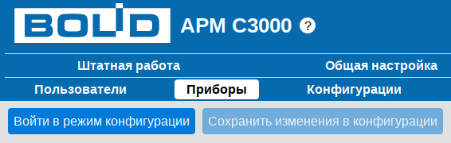
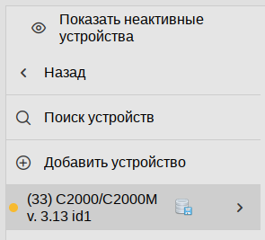
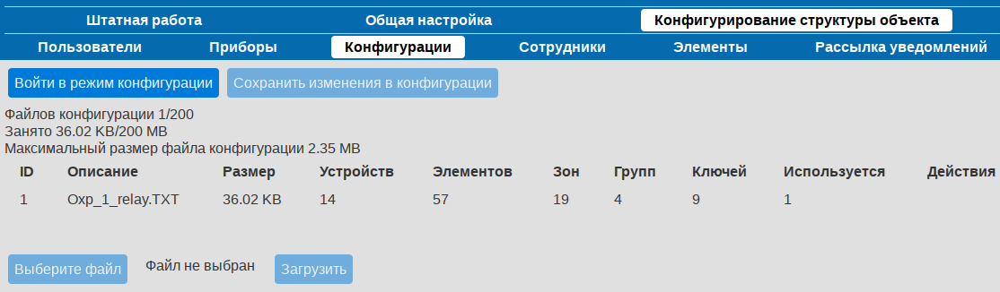
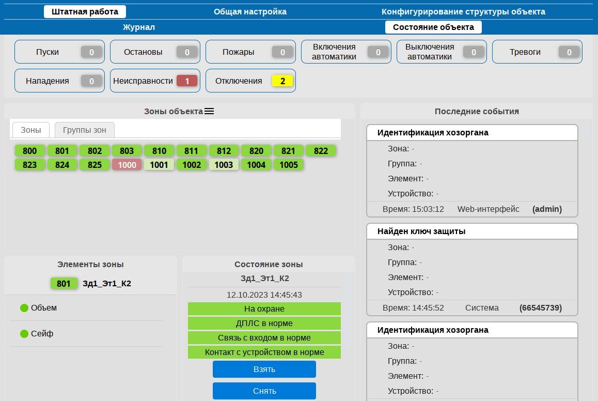
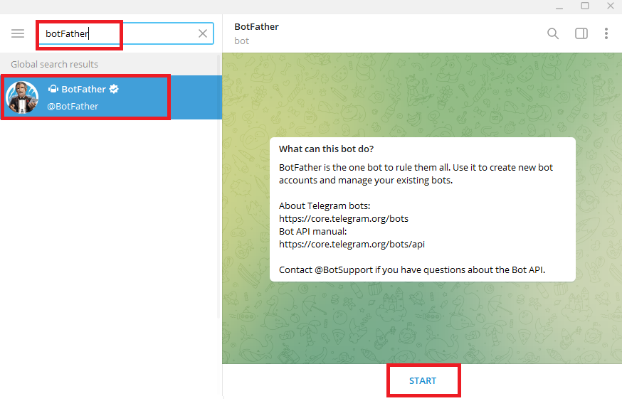
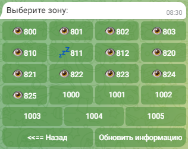
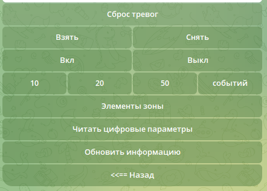
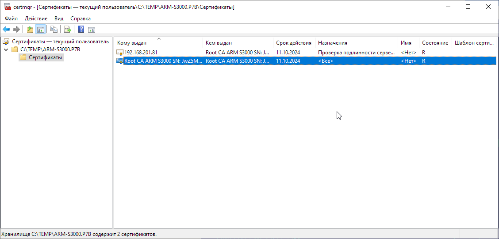
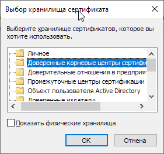

# bolid-arm-s3000-doc / quick-start

# АРМ С3000: быстрый старт

<!-- NOTE marks:

    - todo
      - in visible text: **TODO**: <description>
      - in comments: TODO

    - screenshot here
      - in visible text: **screenshot** **screenshot: <description>**
      - in separate 1-line comment:
-->

<!-- SS -->
<!-- SS: <description> -->

<!--

-->

<!-- NOTE replace:

    + screenshot:
      - TODO: deal with large image files saved from libreoffice (02.png, 05.png)
      - vim cmd (select -> :so<CR>):
        .,$s,\v\<!-- SS: ([0-9]+) --\>,,gc

    + TODO web links to SW/HW when first mentioned

    + - => — // long
      - vim cmd (select -> :so<CR>):
        .,$s,-,—,gc
      - sed cmd:
        sed -E -e 's/-/—/g'

    + "" => «»
      - vim cmd (NB: \v => 'very magic'):
        .,$s,\v(^| )",\1«,gc
        .,$s,"\v( |$),»\1,gc
      - sed cmd:
        sed -E -e 's,(^| )",\1«,g' -e 's,"( |$),»\1,g'

    + footnotes number N - reference: ~N~ => N
      - vim cmd:
        .,$s,\v \~([0-9]+)\~,\1,gc
      - sed cmd:
        sed -E -e 's, ~([0-9]+)~,\1,g'

    + footnotes - footnote number N itself: ~N~: => **N**:
      - vim cmd:
        .,$s,\v^\~([0-9]+)\~:,**\1**:,gc
      - sed cmd:
        sed -E -e 's,^~([0-9]+)~:,**\1**:,g'

TESTING:
new: в течение определенного времени ~1~
was: в течение определенного времени (~1)

    + **iso**     => **ИСО Орион** // TODO give transcript on 1st use
      - vim cmd (NB: \N => 'nomagic'):
        .,$s,\M**iso**,**ИСО Орион**,gc
      - sed cmd:
        sed -E -e 's,\*\*iso\*\*,**ИСО Орион**,g'

    + **pro** => **АРМ Орион Про** // i.e. arm
      - vim cmd:
        .,$s,\M**pro**,**АРМ Орион Про**,gc
      - sed cmd:
        sed -E -e 's,\*\*pro\*\*,**АРМ Орион Про**,g'

    + **s3k**     => **АРМ С3000** // TODO give transcript on 1st use
      - vim cmd:
        .,$s,\M**s3k**,**АРМ С3000**,gc
      - sed cmd:
        sed -E -e 's,\*\*s3k\*\*,**АРМ С3000**,g'

    + **s2k-eth** => **С2000-Ethernet**
      - vim cmd:
        .,$s,\M**s2k-eth**,**С2000-Ethernet**,gc
      - sed cmd:
        sed -E -e 's,\*\*s2k-eth\*\*,**С2000-Ethernet**,g'

    + **s2km**    => **С2000М**
      - vim cmd:
        .,$s,\M**s2km**,**С2000М**,gc
      - sed cmd:
        sed -E -e 's,\*\*s2km\*\*,**С2000М**,g'

    + **s2km2**   => **С2000М исп. 02**
      - vim cmd:
        .,$s,\M**s2km2**,**С2000М исп. 02**,gc
      - sed cmd:
        sed -E -e 's,\*\*s2km2\*\*,**С2000М исп. 02**,g'

    + `Орион`     => `Орион`     // protocol
    + `Орион Про` => `Орион Про` // protocol

    + **UProg**
      [**UProg**](https://bolid.ru/production/orion/po-orion/po-config/uprog.html)
    + **PProg**
      [**PProg**](https://bolid.ru/production/orion/po-orion/po-config/pprog.html)

    + [s3k-re x.x.x yyy pNNN]()     => links to s3k manual, "Руководство по эксплуатации"
    + [s2k-eth-re x.x.x yyy pNNN]() => links to s2k-eth manual
    + [XXX-re x.x.x yyy pNNN]()     => links to XXX manual

    + TODO double quotes in referenced manual's sections, e.g.:
           "Вкладка "Порты C2000 Ethernet""
           =>
           WIP: remove inner pair of quotes
-->

<!-- src: `Инструкция по быстрому старту АРМ С3000 23_03_02.pdf` -->

<!--
## TOC: original

- 1 Установка ПО
- 2 Подключение к системе
- 3 Дата и время
- 4 Использование https протокола. Установка SSL сертификата
  - 4.1 Генерация самоподписанного сертификата
  - 4.2 Установка сертификата в ОС Windows
  - 4.3 Включение доступа к системе по https
- 5 Подключение устройств
- 6 Настройка пульта для работы с «АРМ С3000»
- 7 Подключение устройств за «С2000-Ethernet». Создание порта «С2000-Ethernet»
- 8 Создание линий
- 9 Конфигурация устройств
  - 9.1 Чтение конфигурации из пульта
  - 9.2 Создание конфигурации для пульта
  - 9.3 Создание конфигурации для линии без пульта
  - 9.4 Загрузка конфигураций в АРМ С3000
  - 9.5 Применение конфигураций в АРМ С3000
- 10 Рассылка уведомлений. Настройка Телеграмм бота
- 11 Добавление новых пользователей
- 12 Штатное использование
-->

<!--
## TOC: WIP

- Введение
- Соглашения и условные обозначения
- Сокращения
- Установка ПО
  - supported OS
  - link:
    - docker-linux.md
    - docker-windows.md
    - win.md
- Подключение к системе
  - localhost
  - http port
  - mention port forwarding // ?
  - default login/password
- Дата и время
  - important for:
    - s2km
    - telegram bot
- Использование защищенного соединения // was: протокола https
  - important, highly recommended (that's why it here)
  - generate self-signed certificate (web-interface)
  - download generated cert
  - install cert (Windows): to "Trusted Root Certification Authorities"
- Подключение устройств
  - Общие сведения
    - interfaces
    - converters
    - port definition
    - line definition
    - protocols
    - speed
  - Настройка пульта
  - Подключение устройств через **s2k-eth**
    - Настройка прибора **s2k-eth**
    - Добавление порта **s2k-eth** в web-интерфейсе

- "Режим конфигурации" - manual 2.3.5.1, p.71
                                         p.82
  - on pages: devices, staff, configs
  - config can be *applied* to:
    - *line*                     working on top of the `orion` proto
    - *s2km* connected to *line* working on top of the `orion pro` proto
      && if *s2km* has been *added* to **s3k** database
-->

<!--
## TOC: actual (before rearrange)

- Введение
- Соглашения и условные обозначения
- Сокращения
- Установка **s3k**
- Подключение и вход в систему
- Дата и время
- Использование защищенного соединения
- Подключение устройств
- Настройка пульта для работы с **s3k**
- Подключение устройств через **s2k-eth**
- Создание и свойства линии
- Работа с конфигурациями пультов
  - Сохранение пульта в базе данных **s3k**
  - Загрузка конфигурации пульта в **s3k**
  - Чтение конфигурации из пульта, подключенного к **s3k**
  - Применение загруженной конфигурации к пульту
  - Применение загруженной конфигурации к линии без пульта
- Добавление пользователей
- Рассылка уведомлений. Telegram
  - Каналы уведомлений
  - Создание бота
  - Регистрация созданного бота в **s3k**
  - Создание пользователя для работы с ботом
-->

<!--
## TOC: to rearrange

- Введение
- Соглашения и условные обозначения
- Сокращения
- Установка **s3k**
- Подключение и вход в систему

- Подключение устройств
  - Настройка пульта для работы с **s3k**
  - Создание и свойства линии

  - Использование преобразователей **s2k-eth**

- Работа с конфигурациями пультов
  - Сохранение пульта в базе данных **s3k**
  - Загрузка конфигурации пульта в **s3k**
  - Чтение конфигурации из пульта, подключенного к **s3k**
  - Применение загруженной конфигурации к пульту
  - Применение загруженной конфигурации к линии без пульта

- Рассылка уведомлений. Telegram
  - Каналы уведомлений
  - Создание бота
  - Регистрация созданного бота в **s3k**
  - Создание пользователя для работы с ботом
- Пользователи
- Использование защищенного соединения
-->

## Введение

<!-- TODO short description -->

Руководство призвано возможно скорее ввести читателя в курс дела,
познакомив с особенностями и наиболее важными настройками
новой системы **s3k**
и позволить начать ее эксплуатацию.

Документ предназначен для технических специалистов, имеющих опыт работы
с программными продуктами и аппаратными средствами разработки
компании **Bolid**. Следует быть знакомым
с использованием и настройкой таких приборов, как пульт
**s2km** и преобразователь **s2k-eth**, а также
программами их настройки - **PProg** и **UProg**.
Помощь в понимании окажет и знакомство с **pro**.

Описывая вкратце тот или иной аспект системы, мы будем
приводить ссылки на соответствующие разделы руководства
пользователя и других документов, содержащих
более подробную информацию и справочные данные.

При изложении материала будем ориентироваться,
в основном, на наиболее типичный сценарий:
в распоряжении пользователя находиться объект,
охваченный пожарными и/или охранными системами
приборов **iso** и контролируемыми,
как правило, с помощью пульта **s2km**.

Нашей целью будет являться настройка **s3k** для управления такой
системой, отображения состояния входящих в нее элементов и
получения уведомлений о происходящих событиях.

<!-- TODO r/o fire alarm systems: should we explain why -->
**Примечание:** 
В данной версии **s3k** существует ограничение на использование
ее с системами пожарной сигнализации и автоматики: возможно только
получение информации о событиях и отображение состояния приборов,
но не управление ими.

## Соглашения и условные обозначения

- Словом *пульт* будем обозначать устройства пультов **s2km** и
  **s2km2**, оговаривая, где это необходимо, различия между ними.
- Ссылаясь в тексте на *Руководство по эксплуатации* (или просто *Руководство*),
  мы имеем в виду соответствующий документ с описанием **s3k**.
- **Полужирным** шрифтом выделяются названия программных продуктов
  и аппаратных средств.
- *Курсив* применяется для обозначения технических терминов
  и в иных случаях для выделения частей текста.
- **Внимание:**
  так обозначены важные замечания.
- **Примечание:**
  краткие аннотации к основному тексту.

<!--
TODO Руководство or руководство?
-->

## Сокращения

<!-- TODO ? QR - Quick Response - Быстрый Отклик (for QR-code) -->
АРМ — автоматизированное рабочее место 
БД — база данных 
ИСО — интегрированная системы охраны 
КУ — канал уведомлений 
ОС — операционная система 
ПО — программное обеспечение

## Установка **s3k**

**s3k** поставляется в виде образов **Docker** для систем
Windows и Linux, а также программы установки
в качестве службы (service) для ОС Windows.

Поддерживаются несколько дистрибутивов Linux, в том числе
Alpine, Astra и Ubuntu нескольких версий.

Системные требования и инструкции по установке
содержатся в документах:

<!-- TODO publishing: remove links -->
<!-- TODO publishing: check exact titles -->
- [Установка образов Docker в ОС Linux](docker-linux.md)
- [установка образов Docker в ОС Windows](docker-windows.md)
- [Установка в ОС Windows](win.md)

**Внимание:** 
При установке и запуске **s3k**
важно убедиться в том, что часовой пояс, дата и время на
локальной машине установлены правильно.
Это влияет как на работу самой системы,
так и на подключенные устройства: при установлении соединения
им отправляется команда синхронизировать дату и время с **s3k**.

## Подключение и вход в систему

После запуска система **s3k** будет доступна на всех сетевых интерфейсах
по протоколу HTTP. Порт для соединения задается при установке
(описано в инструкциях, см. "Установка" выше).
Например: `http://127.0.0.1:20080`.

Для доступа и работы с системой используется web-интерфейс.

При успешном подключении в браузере откроется страница
авторизации, - следует ввести установленные изначально имя
пользователя ("admin") и пароль ("armS3000").

Данные учетной записи `admin` рекомендуется сразу же изменить,
задав новый пароль (см. раздел "Пользователи").

Также стоит рассмотреть переход на защищенное соединение
по протоколу HTTPS (см. "Использование защищенного соединения").

## Подключение устройств

<!-- 2C: manual 2.2.3 Схема внешних соединений -->

Устройства **iso** могут быть подключены к **s3k** следующими способами:
1. через последовательный порт RS-232
2. через порт RS-485
3. по сети, через устройство **s2k-eth**

Приборы могут подключаются как напрямую,
так и через преобразователи интерфейсов (например, с помощью
[Универсального преобразователя интерфейсов USB-RS](https://bolid.ru/production/orion/interface-converter/usb_rs.html)
производства компании **Bolid**).

Каждому из трех перечисленных способов подключения
ставится в соответствие понятие *порт*.

Обратите внимание, что в терминологии **s3k** *портом*
может являться как физическое устройство (например, COM-порт),
так и виртуальный последовательный порт, соответствующий
соединению по сети через **s2k-eth**.

Настройка производится посредством добавления *порта* -
`RS` или `С2000-Ethernet` на странице
*`Конфигурирование структуры объекта`* → *`Приборы`*.

Далее на вкладке *`Линии и протоколы`* добавляется так называемая
*линия* для подключения устройств - это определенный *порт* и набор
настроек, таких как *протокол*, скорость соединения и ряд других.

**Примечание:** 
*Порт*, задействованный в одной из линий, не может быть использован
при создании других.

Для взаимодействия с устройствами может использоваться один из двух
*протоколов*: `Орион Про` или `Орион`. Первый применяется для связи
с *пультом*, второй - при подключении приборов напрямую, без пульта.

Для протокола `Орион Про` доступны скорости
9600, 19200, 38400, 57600, 115200 бит/с;
соединение по протоколу `Орион` возможно только на скорости 9600 бит/с.

### Настройка пульта для работы с **s3k**

В настройках устройства пульта (параметры второго порта связи)
установить следующие значения:
- Режим: "Компьютер"
- Включить "Запрашивать состояния С2000М"
- "Скорость" должна соответствовать выбранной скорости в установках для *линии*
  (см. раздел "Создание и свойства линии").

В руководстве по эксплуатации **s2km** см. раздел "Параметры второго порта связи".

**Внимание:** 
Нужно убедиться, что на пульте установлена минимально допустимая версия прошивки
(и обновить ее, если необходимо, с помощью **PProg**):
- для пульта **s2km** - не ниже 3.14 или 4.14
  (в зависимости от аппаратной версии прибора)
- для пульта **s2km2** - не ниже 5.02

[Прошивки для **s2km**](https://bolid.ru/production/orion/network-controllers/s2000m.html#download)

### Создание и свойства линии

Линия создается в web-интерфейсе на странице
*`Конфигурирование структуры объекта`* → *`Приборы`* → *`Линии и протоколы`*.

При нажатии на "Добавить линию",
в правой части окна появится список параметров создаваемой линии,
из которых основными являются *порт*, *протокол* и *скорость*.

При успешном добавлении новая линия появиться в списке,
а при установленном параметре "Включить опрос"
будут обнаружены (в течение определенного времени1)
и добавлены в список устройства, подключенные к линии.

**1**: 
Не более, чем значение параметра *таймаут запроса новых событий*
(40 мс по умолчанию), умноженное на 127.

В секции "Тайминги" устанавливаются временны́е параметры для используемого порта.
В большинстве случаев достаточно оставить значения по умолчанию,
но для настройки портов типа **s2k-eth**
рекомендуется изучить раздел
"Требования и рекомендации по настройке временны́х параметров"
документации **s2k-eth**.

**Примечание:** 
В целях отладки, для гарантированного обнаружения устройств,
подключенных к линии, можно выставить намеренно увеличенные значения
*таймаута запроса новых событий* и *таймаута ответа на команду*,
например, 250 и 2000, соответственно. Но при штатном использовании
системы такие значения использовать не рекомендуется.

**Примечание:** 
Сообщение "Добавлено максимум линий" в списке линий
говорит о том, что все добавленные *порты* (как RS, так и **s2k-eth**)
уже используется в существующих линиях.

Информация о линиях приведена в разделах
"Параметры линий" и "Добавление линии"
руководства по эксплуатации.

<!--
TODO apply cfg button
TODO line properties - *config applied* param shown when:
  - has *config* applied
  - proto: orion
TODO "Options": not described in s3k-re
TODO note on web ui f##kup: click line => props, click ">" => line contents
-->

### Использование преобразователей **s2k-eth**

При подключении устройств **iso** через **s2k-eth**,
для использования его с **s3k**
необходимо изменить конфигурацию прибора.

Настройка осуществляется с помощью утилиты **UProg**
и заключается в задании значений таких параметров:
- IP-адрес компьютера с **s3k**
- Совместимость - "Иные приборы"
- "UDP-порт удаленного устройства"
  (параметр называется "UDP-порт получателя" в версиях **s2k-eth** < 3.10)
- "Использовать один порт на прием/передачу"
  ("Использовать один порт на чтение/запись" для версий **s2k-eth** < 3.10)

Описание см. в руководстве по эксплуатации **s2k-eth** ("Настройка прибора").

Затем в web-интерфейсе **s3k** следует добавить *порт* на странице
*`Конфигурирование структуры объекта`* → *`Приборы`* → *`Порты c2000 Ethernet`*,
установив следующие параметры
в соответствии с проведенными настройками **s2k-eth**:
- Локальный порт **s3k**
- адрес IP или имя DNS устройства **s2k-eth**
- UDP порт **s2k-eth**

Так как пользовательский интерфейс свойств **s2k-eth** в программе **UProg**
может отличаться для различных версий прибора,
рекомендуется обратиться к снимкам экрана
"Соответствие параметров конфигураций"
в руководстве ("Вкладка Порты C2000 Ethernet").

**Примечание:** 
О случаях, когда при работе с **s2k-eth**
может потребоваться перенаправление портов,
рассказано в разделе "Перенаправление портов UDP"
руководств по установке (см. "Установка **s3k**").

<!--
- from qstart: WTF "типа порта"
- from manual, WTF "virt. line"
-->

## Работа с конфигурациями пультов

Для отображения состояния приборов, задействованных
в **iso** и управления ими в **s3k** требуется
доступ к конфигурации пульта,
включающей в себя информацию о
зонах, группах зон, сотрудниках, паролях и уровнях доступа.

Создание и редактирование такой конфигурации
(с возможностью экспорта в файл)
осуществляется с помощью утилиты **PProg**.

Для устройств, подключенных напрямую (без участия пульта)
также необходима конфигурация, созданная в **PProg**.

Конфигурацию необходимо загрузить в **s3k**
(см. "Загрузка конфигурации пульта в **s3k**")
и *применить* - к пульту или к линии.

Посредством *применения* мы сообщаем системе о том,
что пульт или линия настроены определенным образом
и работают в соответствии с заданной конфигурацией.

*Применение* возможно:
- Для пульта. Пульт должен быть предварительно
  сохранен в базе данных **s3k**
  (см. "Сохранение пульта в базе данных **s3k**").
- Для линии. Только для линий,
  работающих по протоколу `Орион`
  (см. "Применение загруженной конфигурации к линии без пульта").

Применение, а также другие действия с конфигурациями
должны производятся в специальном *режиме конфигурации*,
доступном на страницах
*`Приборы`*, *`Конфигурации`* и *`Сотрудники`*
вкладки
*`Конфигурирование структуры объекта`*.

Войти в режим позволяет кнопка "Войти в режим конфигурации",
выйти из него с сохранением изменений - "Сохранить изменения в конфигурации".

Подробнее - в руководстве, "Режим конфигурации системы".

**Внимание:** 
После выхода из режима конфигурации должно пройти некоторое время
(порядка нескольких секунд), прежде чем система перезагрузится.
Следует дождаться пока web-страница не будет обновлена.

### Сохранение пульта в базе данных **s3k**

Работа с конфигурациями начинается с сохранения пульта в базе данных **s3k**.

На странице
*`Конфигурирование структуры объекта`* → *`Приборы`* → *`Линии и протоколы`*
необходимо выбрать нужную линию, затем пульт
и нажать кнопку "Сохранить в БД" в правой части окна.

После успешного добавления в списке устройств рядом с пультом
будет отображаться значок с изображением базы данных.

Добавление пульта в базу данных **s3k**
необходимо для устройств, автоматически обнаруженных системой
(когда параметр линии "Включить опрос" установлен).
Добавленные же вручную устройства
сохраняются в базе данных **s3k** при их добавлении.

<!--
p. 91:
Устройства, подключенные к «АРМ С3000», можно сохранить в базу данных системы.
Сохранённые устройства опрашиваются с более высоким приоритетом.
Для сохранённых устройств рядом с названием отображается значок [db img].

Устройство можно добавить в базу данных вручную, создав новое
(п. 2.3.5.3.1.5 - Добавление устройств в базу данных вручную)
или
выбрать найденное устройство на линии и добавить его в базу данных
(п. 2.3.5.3.1.4 - Добавление устройств в базу данных при нахождении).

Устройства, добавленные в базу, будут всегда отображаться на линии
(не зависит от того, активны или неактивны),
при удалении линии сохраненные устройства на линии будут TODO так же удалены.

Для штатной работы необходимо применение конфигурации к подключенным устройствам.
Конфигурация может быть применена в режиме конфигурации (п. 2.3.5.1)
к следующим сущностям (подробнее о применении конфигурации в п. 2.3.5.3.1.6 ):
- к линии, которая работает по протоколу «Орион»
- к пульту, находящемуся на линии, которая работает по протоколу «Орион Про».
Такой пульт должен быть добавлен в базу данных «АРМ С3000».
-->

<!-- s3kq orig:
- 9 Конфигурация устройств                           - p. 13
    - 9.1 Чтение конфигурации из пульта              - p. 16
    - 9.2 Создание конфигурации для пульта           - p. 17
    - 9.3 Создание конфигурации для линии без пульта - p. 21
    - 9.4 Загрузка конфигураций в АРМ С3000          - p. 23
    - 9.5 Применение конфигураций в АРМ С3000        - p. 23
-->

### Загрузка конфигурации пульта в **s3k**

В программе **PProg** нужно экспортировать конфигурацию
(кнопка "Сохранить конфигурацию в файл") и загрузить полученный файл в **s3k**:
на странице *`Конфигурирование структуры объекта`* → *`Конфигурации`*
нажать кнопку "Войти в режим конфигурации", затем "Выберите файл" и "Загрузить".
В списке должно появиться имя загруженного файла и сопутствующая информация.

Закончив загрузку, следует нажать "Сохранить изменения в конфигурации".

**Внимание:** 
Конфигурация, загруженная в **s3k** должна совпадать
с конфигурацией, сохраненной в устройстве пульта.

См. руководство - "Страница Конфигурации".

### Чтение конфигурации из пульта, подключенного к **s3k**

При невозможности подключиться к пульту напрямую,
можно воспользоваться следующим способом,
соединившись с ним через **s3k**, используя **PProg**:

- Выбрать в дереве устройств узел "TCP/IP", в контекстном меню нажать "Добавить".
- В диалоговом окне указать IP-адрес машины с установленным **s3k**
  и номер порта (80 порт для соединения по протоколу HTTP, 443 - для HTTPS).
- Если соединение установлено успешно, в открывшемся окне "Авторизация на С3000-Hub"
  ввести имя пользователя и пароль: пользователь (с ролью `service`) должен быть
  предварительно создан в web-интерфейсе **s3k**, см. "Пользователи".
- Выбрать в дереве нужный пульт и нажать кнопку "Считать конфигурацию из пульта"
  на панели инструментов, введя при запросе пароль, установленный *на пульте*.
- Дальнейшие действия описаны в разделе
  "Загрузка конфигурации пульта в **s3k**".

### Применение загруженной конфигурации к пульту

Для применения конфигурации ее прежде необходимо загрузить на сервер
(описано в разделе "Загрузка конфигурации пульта в **s3k**" выше).

На странице
*`Конфигурирование структуры объекта`* → *`Приборы`* → *`Линии и протоколы`*
выбрать нужную линию, затем пульт и нажать кнопку "Войти в режим конфигурации".

После этого станет доступной кнопка "Конфигурация...".
При нажатии откроется окно со списком доступных конфигурационных файлов.

Выбрав из списка нужный, нажатием на кнопку "Сохранить"
применить конфигурацию к пульту.

Записать изменения, нажав "Сохранить изменения в конфигурации".

В случае успеха, на странице *`Штатная работа`* → *`Состояние объекта`*
появятся элементы, зоны и группы зон, считанные из примененной конфигурации.

### Применение загруженной конфигурации к линии без пульта

Действия по применению конфигурации к линии без пульта аналогичны
приведенным выше с той лишь разницей, что производятся они
на странице свойств линии.

## Рассылка уведомлений. Telegram

**s3k** позволяет организовать удаленное взаимодействие оператора с системой
через сеть Интернет, используя для этого *чат-боты* мессенджера Telegram.

*Боты* Telegram представляют собой специальные программы,
применяемые для задач сбора данных и автоматизации.

С точки зрения пользователя мессенджера,
бот выглядят как обычный собеседник в чате,
но способный реагировать на ряд определенных *команд*.
Команды могут отдаваться боту как в виде текстовых сообщений,
так и посредством элементов пользовательского интерфейса -
кнопок, меню и т.д.

В нашем случае речь идет о боте, способном доставлять сообщения о происходящих
на объекте событиях и отдавать команды управления приборами **iso**
(например, "взять под охрану" или "сбросить тревоги").

Для использования этой возможности необходимо наличие
подключения к сети Интернет и учетной записи пользователя Telegram.

Настройка включает в себя следующие действия:
- создание канала уведомлений, фильтров
- создание бота
- регистрация созданного бота в **s3k**
- создание пользователя для работы с ботом

### Каналы уведомлений

События, включаемые в состав уведомлений,
определяются так называемым "каналом уведомлений" (КУ) - определенным набором фильтров.
Каждый фильтр содержит правила отбора интересующих событий по различным критериям.
Примером может служить получение уведомлений о
"пожарах и включениях автоматики в зонах №1 и №2".

Фильтры событий настраиваются на странице
*`Конфигурирование структуры объекта`* → *`Рассылка уведомлений`*,
вкладка "Каналы уведомлений".

Фильтрация возможна по
типам событий, элементам, зонам, группам, сотрудникам
и подробно описана в начале раздела "Рассылка уведомлений"
руководства по эксплуатации.

### Создание бота

Бот создается в клиентской программе Telegram
(существуют версии для ПК и мобильных устройств).

- Найти пользователя (бота) с именем `@BotFarther`.
  Убедиться, что найденная учетная запись имеет официальный статус
  (рядом с именем находится подтверждающий значок).

- Начать работу с ботом, нажав "START".
- В полученном после этого сообщении содержится список доступных команд,
  исполняемых ботом. Выбрать команду "/newbot".
- Далее следуют два вопроса с предложением
  задать отображаемое имя и имя пользователя,
  которое должно оканчиваться на "bot", например,
  "MyS3000bot".
- При успешном выполнении будет получено сообщение
  со сведениями о созданном боте, включая имя, ссылку и *токен*.
  *Токен* представляет собой строку, используемую для авторизации
  и управления ботом и является конфиденциальной информацией.

Руководство: "Настройка нового бота Telegram"

### Регистрация созданного бота в **s3k**

На странице
*`Конфигурирование структуры объекта`* → *`Рассылка уведомлений`*
(вкладка "Телеграм")
нажать на кнопку "Добавить нового бота" ("+") и заполнить
поля с параметрами, из которых обязательным является "Токен бота"
(вводится строка токена, полученная на предыдущем шаге).

**Примечание:** 
Если в сети используется прокси-сервер,
его параметры необходимо указать на странице свойств бота:
следует иметь в виду, что установки прокси-сервера,
заданные в свойствах системы (например, в ОС Windows),
не принимаются во внимание при работе **s3k** с Telegram.

После добавления и в случае установления соединения с
сервером Telegram, рядом с именем в списке ботов
должен отобразиться значок зеленого цвета, что
говорит об успешном завершении операции.
Теперь можно приступить к созданию пользователя бота.

### Создание пользователя для работы с ботом

- Нажать на странице свойств бота кнопку вызова меню в правом верхнем углу
  и выбрать пункт "Список пользователей".
- Добавить нового пользователя (кнопка слева сверху), после чего
  ввести "Пользовательское описание" (фактически - отображаемое имя)
  и нажать "Добавить".
  Также при создании и редактировании пользователя
  доступен ряд других параметров.
  За подробностями можно обратиться к руководству
  ("Настройка нового бота Telegram").
- На открывшейся затем странице "Информация для привязки"
  перейти по ссылке (или сканировать QR-код) для авторизации в Telegram.
  Поля "информации для привязки" (ссылка, QR-код) доступны также
  на странице "Редактирование пользователя".
  Если "привязка" (то есть авторизация) пользователя не была проведена,
  его статус будет показан как "Ожидает связывания".
- Открыв вновь список пользователей и отредактировав нужного,
  задать набор уведомлений, которые он будет получать, -
  выбрав канал уведомлений в поле "Привязан к".

Результатом будет являться возможность
соединения и работы с новым ботом
в любом из клиентских приложений Telegram.

 
 

<!--
2ASK [x] Администратор бота => can issue text commands in rus (e.g. "настройки")
TODO [info on bots](https://core.telegram.org/bots) + bots, telegram intro (rus)?
2ASK Лимиты/Таймауты - disabled?
-->

## Пользователи

Несколько пользователей могут одновременно подключаться
к запущенному экземпляру **s3k**, используя web-интерфейс.

Учетные записи настраиваются на странице
*`Конфигурирование структуры объекта`* → *`Пользователи`*, -
с возможностью добавления, редактирования и удаления.

Изначально в системе присутствует только один пользователь - *admin*.

Существует два типа учетных записей (*ролей*): `service` и `operator`.
*Роль* определяет набор действий, доступных данному пользователю.

Пользователю с ролью `service` доступен весь функционал **s3k**.

Роль `operator` ограничивает права,
а также число отображаемых компонентов web-интерфейса.
Пользователь с такой ролью будет иметь доступ только к страницам
- *`Штатная работа`*
- *`Общая настройка`* → *`Подключения`*
- *`Конфигурирование структуры объекта`* → *`Пользователи`*.

**Примечание:** 
Метод сброса пароля в случае его утери для учетной записи *admin*
описан в документах по установке (см. "Установка **s3k**").

См. "Страница Пользователи" в руководстве.

<!--
TODO
- note about changing passwords
- rename section
- доступ из программ: UProg, PProg или Shleifes.
- can change own password
2ASK [x] сброс пароля к настройкам по умолчанию => added in new docs versions
-->

## Использование защищенного соединения

При работе с сетевыми приложениями, рекомендации по безопасности
включают в себя не только защиту учетной записи администратора,
но также и установление соединения по защищенному протоколу HTTPS.

В этом разделе будет рассмотрена простейшая настройка
**s3k** для организации безопасного соединения.

Прежде всего необходимо создать "самоподписанный" (self-signed) сертификат
в web-интерфейсе на странице *`Общая настройка`* →
*`SSL Сертификаты`* → *`Самоподписанный сертификат`*.

Из параметров достаточно указать IP-адрес или DNS-имя машины с **s3k**
(возможно добавление нескольких адресов и имен) и срок действия.

- **Внимание:** 
В системе может быть установлен лишь один сертификат.
После нажатия на кнопку "Сгенерировать" новый сертификат
будет создан и *заменит* собой установленный ранее.

Включить параметр "Доступ к устройству по протоколу https"
на странице *`Общая настройка`* → *`Сервисное обслуживание`* →
*`Прочие настройки`*, после чего система готова к приему
соединений по протоколу HTTPS.

Настроив программное обеспечение для работы по HTTPS
на рабочих станциях (см. ниже), возможность соединения
по протоколу HTTP можно отключить на этой же странице.

- **Внимание:** 
При изменении параметров на странице настройки, система **s3k**
перезапускается, после чего требуется произвести повторный вход
всем подключенным пользователям.

После этого можно приступить к настройке соединения со стороны клиентского ПО.

Для ОС Windows требуется скачать и установить созданный ранее сертификат,
нажав на странице *`Общая настройка`* → *`SSL Сертификаты`* →
*`Установленный`* кнопку "Скачать цепочку".

Открыв загруженный файл, в списке сертификатов дважды щелкнуть левой
кнопкой мыши тот, имя которого начинается с "Root CA ARM S3000".

Нажать кнопку "Установить сертификат..." и в качестве целевого хранилища
указать "Доверенные корневые центры сертификации"
(Trusted Root Certification Authorities).

Подробнее о сертификатах, особенностях установки в других системах
и web-браузерах - в руководстве, "Импорт и установка сертификатов".

