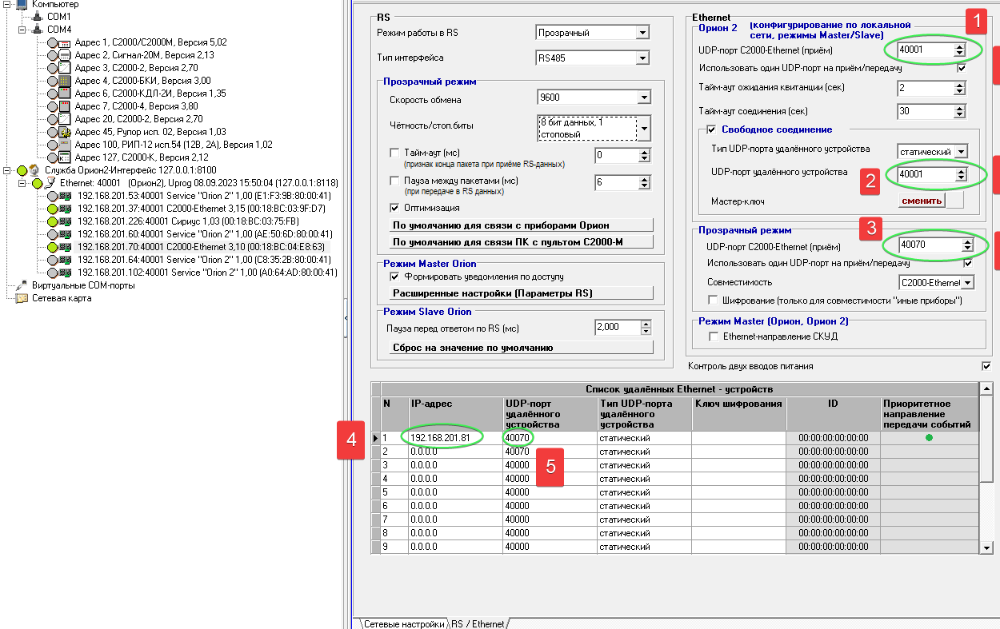
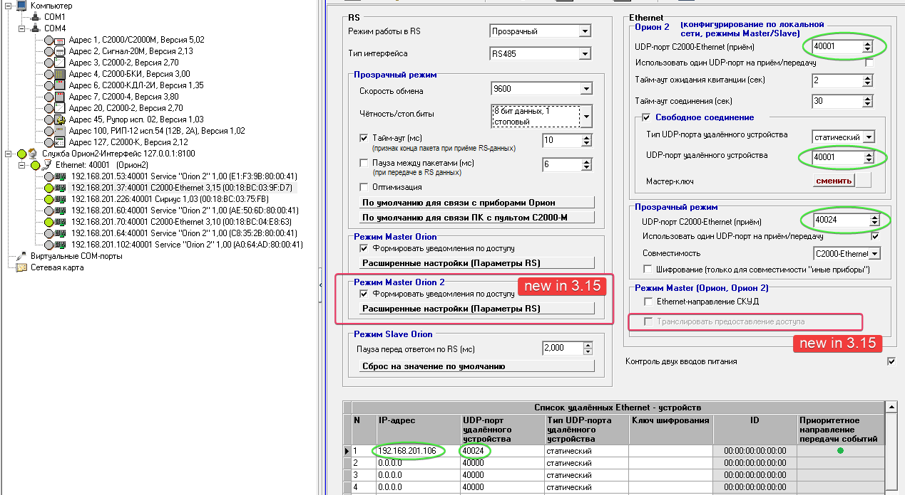

# bolid-arm-s3000-doc / udp_fwd_s2k-ethernet

# arm s3k in docker: UDP port forwarding with s2k-ethernet

`docker_linux_udp_fwd_ss_orig.png`
----------------------------------

screenshot taken from original 'linux docker' pdf document
 
<nobr>`Инструкция по установке АРМ С3000 на ОС Linux (Docker) 23_04_06.pdf`</nobr>

 

`s2k-eth_3.10_uprog_ss.png`
---------------------------

screenshot captured while running <nobr>`uprog 4.1.7.13.510`</nobr> (`s2k-eth 3.10`)

 

`s2k-eth_3.15_uprog_ss.png`
---------------------------

screenshot captured while running <nobr>`uprog 4.1.7.13.510`</nobr> (`s2k-eth 3.15`)

