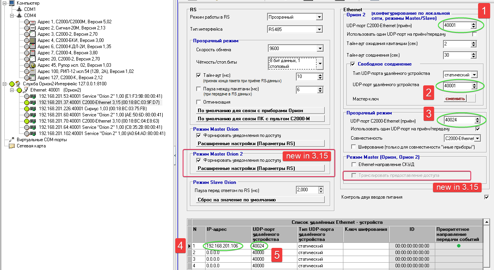

# bolid-arm-s3000-doc / udp_fwd_s2k-ethernet

# arm s3k in docker: UDP port forwarding with s2k-ethernet

`docker_linux_udp_fwd_ss_orig.png`
----------------------------------

screenshot taken from the original 'linux docker' pdf document
 
<nobr>`Инструкция по установке АРМ С3000 на ОС Linux (Docker) 23_04_06.pdf`</nobr>

wtf:
----

- `arm s3k`
  - (1) `локальный порт АРМ С3000: 64497`
  - (2) `UDP порт С2000-Ethernet:  60555`

- `uprog`
  - (3) `UDP-порт отправителя:        60555`
  - (4) `IP-адрес:                    192.168.201.109`
  - (5) `UDP-порт получателя:         20497`
  - (6) `UDP-порт отправителя:        42772`
  - (7) `UDP-порт удаленного устр-ва: 42772`
 

`s2k-eth_3.10_uprog_ss.png`
---------------------------

`s2k-eth 3.10`: screenshot captured while running <nobr>`uprog 4.1.7.13.510`</nobr>

wtf:
----

- `uprog`
  - (1) `[-] UDP порт С2000-Ethernet:         40001          // master-slave`
  - (2) `[-] UDP-порт удаленного устр-ва:     40001          // master-slave -> свободное соединение`
  - (3) `[v] UDP порт С2000-Ethernet (прием): 40070          => port s2k-eth listens on` *match*
  - (4) `[v] IP-адрес:                        192.168.201.81 => connecting PC's ip`
  - (5) `[v] UDP-порт удаленного устр-ва:     40070          => port on s2k-eth to connect to` *match*
 

`s2k-eth_3.15_uprog_ss.png`
---------------------------

`s2k-eth 3.15`: screenshot captured while running <nobr>`uprog 4.1.7.13.510`</nobr>

 
