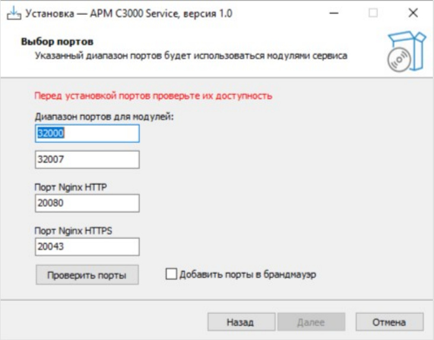
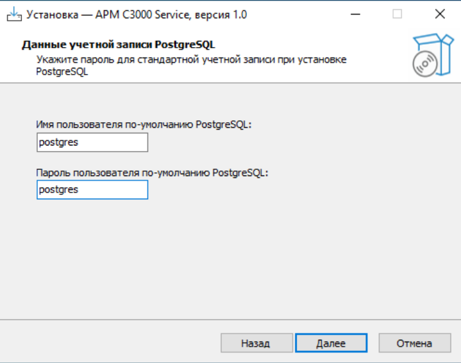
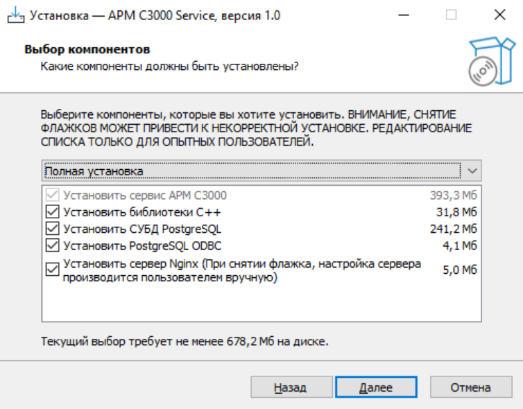
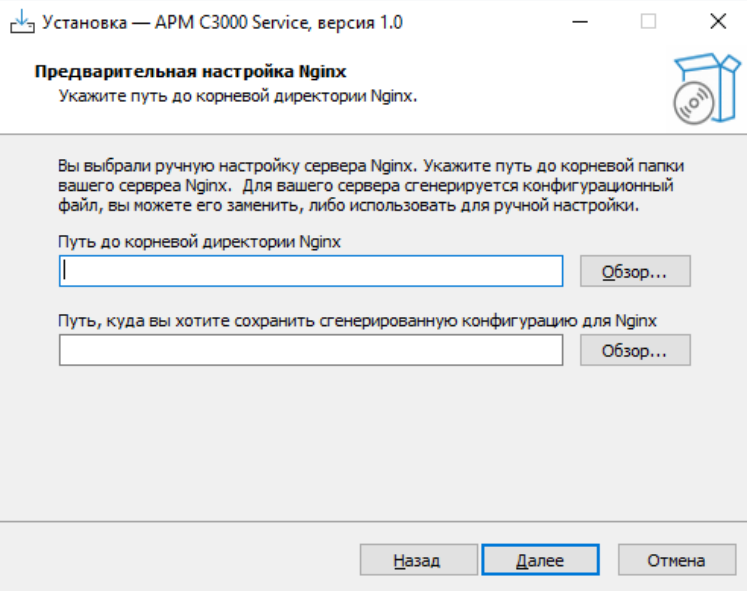

# АРМ С3000: установка в ОС Windows

<!-- SS -->
<!-- SS: <description> -->
<!--
    TODO Nginx => nginx
-->

## Введение

Руководство описывает установку службы (service) **АРМ С3000**
в ОС Windows и предназначено для системных администраторов.

Для работы службы требуются СУБД **PostgreSQL** и web-сервер **Nginx**,
(входят в состав дистрибутива).

Опытные пользователи, запустив *выборочную* установку,
могут отключить эти компоненты и использовать **PostgreSQL**
и/или **Nginx**, уже установленные в системе.

Наличие подходящей версии **PostgreSQL** определяется автоматически.

Для **Nginx** необходимо указать путь к установленному серверу.
В последующем потребуется его настройка, для чего можно использовать
параметры из созданного при установке файла конфигурации `nginx.conf`.

## Соглашения и условные обозначения

- **Полужирным** выделяются названия программных продуктов и аппаратных средств.
- *Курсив* применяется для обозначения технических терминов
  и в иных случаях для выделения частей текста.
- `Моноширинный шрифт` применяется для имен файлов, команд и их параметров,
  а также для примеров выполнения и вывода команд.
- **Примечание:**
  краткие аннотации к основному тексту.

## Сокращения

АРМ — автоматизированное рабочее место 
ОС — операционная система 
ПО — программное обеспечение 
СУБД — система управления базами данных

## Системные требования

- 64-разрядные Windows 8, 10, 11
- 64-разрядные Windows server 2012, 2012R, 2016, 2019, 2022

## Процесс установки

Дистрибутив **АРМ С3000** представляет собой исполняемый файл,
который следует запустить для начала установки. Запуск должен
осуществляться от имени *администратора* системы.

При запуске программы производится выбор метода установки:
полный или выборочный.

За исключением описанных ниже окон настройки, специфичных
для системы **АРМ С3000**, остальные являются стандартными
для программ установки и предлагают выполнить типичные
действия, такие, как просмотр и принятие лицензионного
соглашения, выбор языка, целевой папки, создания ярлыков и т.д.

### Выбор портов

В этом окне производится выбор и проверка доступности сетевых
портов, необходимых для работы **АРМ С3000**.

При вводе в текстовое поле «Диапазон портов для модулей» номера
порта начала диапазона, второе поле (конец диапазона) заполняется
автоматически, в зависимости от числа модулей системы.

Порты для web-сервера **Nginx** могут выбираться произвольно; при
нажатии на кнопку «Проверить порты» их доступность также проверяется.

Отметив «Добавить порты в брандмауэр», можно указать программе
установки внести изменения в настройки сетевого экрана Windows,
разрешающие входящие соединения с сервером **Nginx** на заданных
портах.

### Параметры PostgreSQL

Здесь задается имя и пароль стандартной
учетной записи СУБД **PostgreSQL**.

Если в системе уже имеется сервер, совместимый с **АРМ С3000**,
система будет настроена для работы с ним, - **PostgreSQL** из
состава дистрибутива не устанавливается. В этом случае будет
предложено задать дополнительные параметры подключения:
сетевой адрес и порт.

<!--
NOTE:
- installer: pgsql 9.6
- installer: psqlODBC_x64: 13.02
- debian 12: pgsql 15.3
- 9.6 for win: not supported anymore
- s3k works OK with existing psql 16.0
- psql port: 5432 (/etc/services)
-->

### Выбор компонентов

При запуске *выборочной* установки, пользователь имеет возможность
указать, какие составляющие системы назначить для установки.
Для включения или отключения доступны следующие компоненты:
- Библиотеки C++
- СУБД PostgreSQL
- PostgreSQL ODBC
- Web-сервер Nginx

**Примечание:** 
При наличии в системе установленного сервера **PostgreSQL**,
соответствующий пункт в списке будет недоступен для выбора.

### Параметры Nginx

<!--
Если **Nginx** отсутствует среди выбранных компонентов,
...
потребуется указать путь к папке с установленным Nginx.
-->

